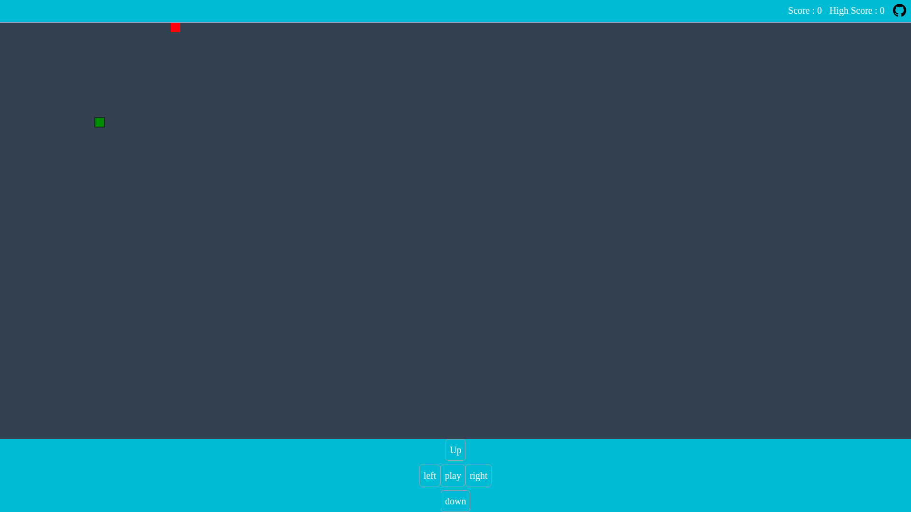

# Snake Game

## Simple Snake Game with basic control

> Note: Make sure the canvas should be in focus,else click some where on canvas for keyboard shortcut binding in PC

## Development server

Run `ng serve` for a dev server. Navigate to `http://localhost:4200/`. The application will automatically reload if you change any of the source files.

## Build

Run `ng build` to build the project. The build artifacts will be stored in the `dist/` directory.

### Download Mobile application (APK)

<a href="https://drive.google.com/file/d/1mtqQ4Ef4R8JPwcig1JeyHtfd0jPd6elp/">download snakeV1</a>
<a href="https://drive.google.com/file/d/1QV4Sbdldm5fAE2fk5KrAWjEa_gZ1szhd/">download snakeV2</a>

